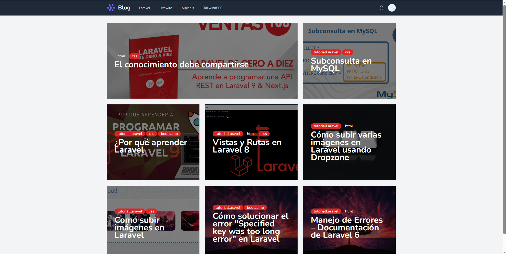
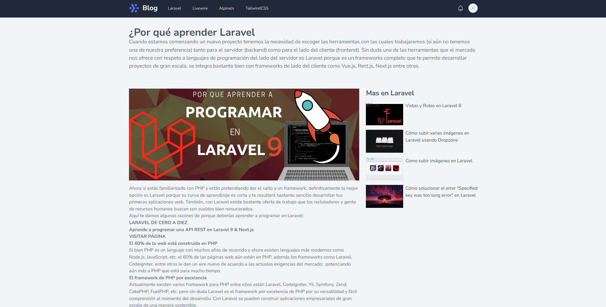
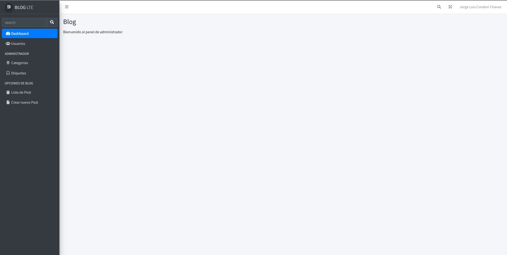
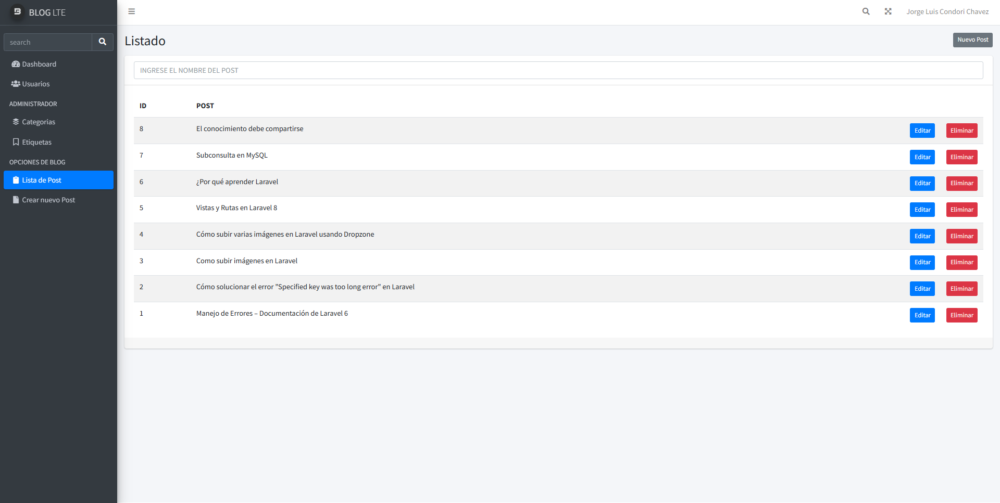
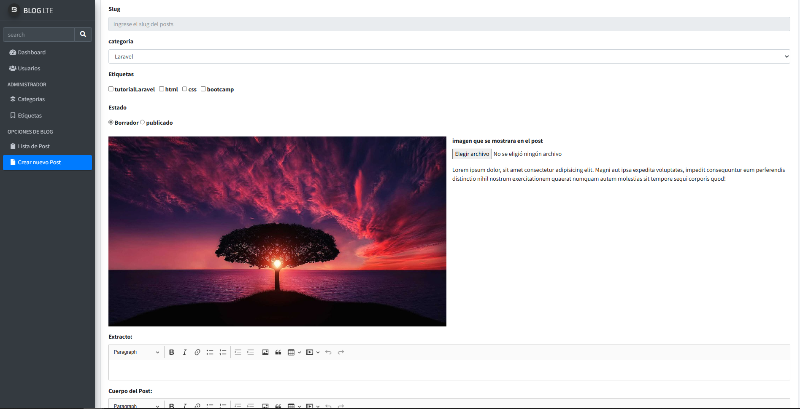

## Blog

este es un proyecto de practica usando laravel, fue actualizado de laravel 8 a 9 y cambiado el uso de webpack a vite

## capturas de pantalla

1) Inicio

   

2) ver post

   

3) panel administrador

   

4) listado de posts

   

5) crear posts

   

